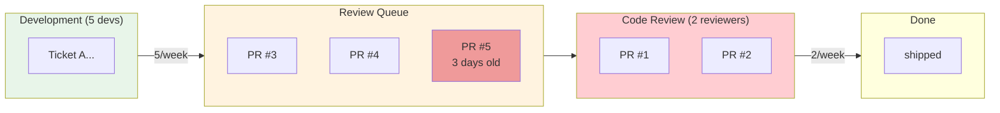
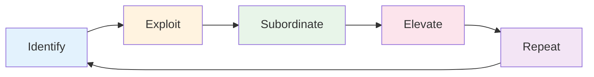
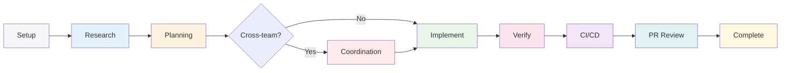
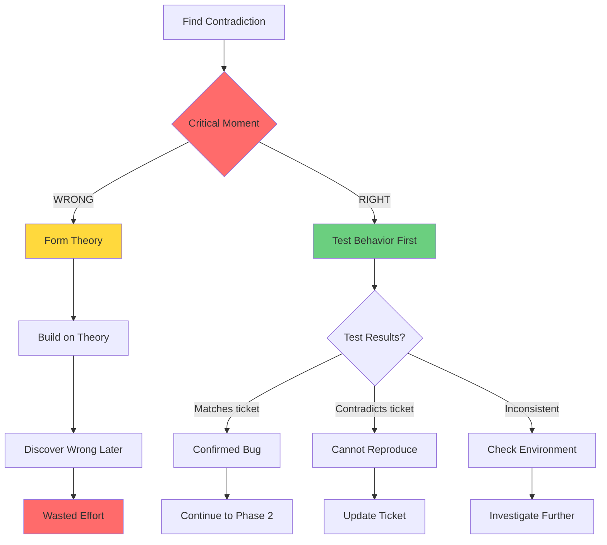
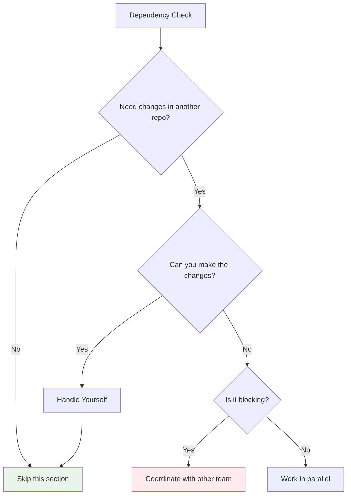
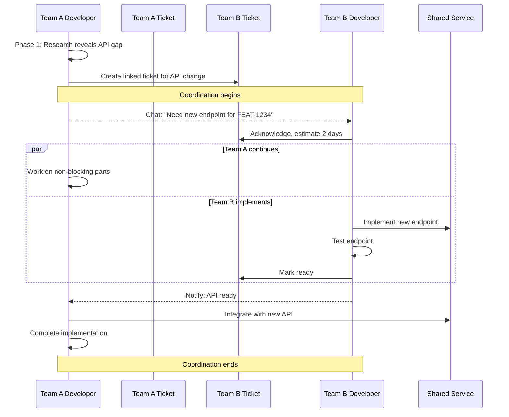
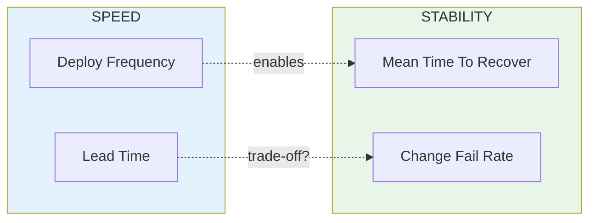
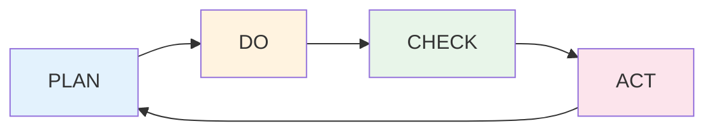
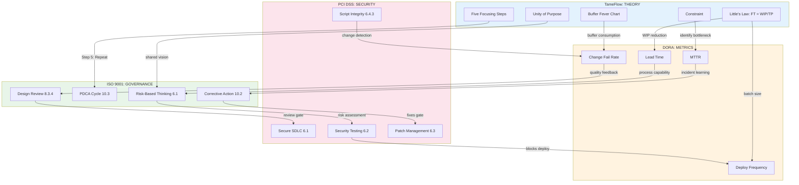
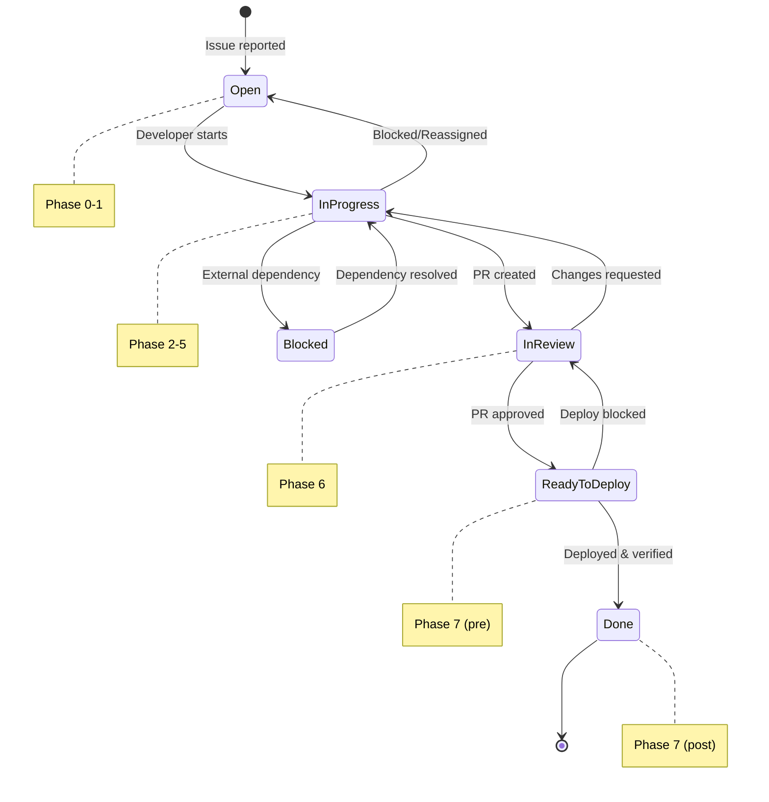

## Table of Contents

**Part I: The Insight**
1. [The One Idea](#1-the-one-idea)
2. [The Busy Trap](#2-the-busy-trap)
3. [The Three Levers](#3-the-three-levers)
4. [The TameFlow Framework](#4-the-tameflow-framework)

**Part II: The Method**
5. [Finding Your Constraint](#5-finding-your-constraint)
6. [Intake and Triage](#6-intake-and-triage)
7. [The Workflow: A Ticket's Journey](#7-the-workflow-a-tickets-journey)
8. [Cross-Team Coordination](#8-cross-team-coordination)
9. [When Plans Change](#9-when-plans-change)

**Part III: Knowing It's Working**
10. [The Feedback Loop](#10-the-feedback-loop)
11. [Buffer and Fever Chart](#11-buffer-and-fever-chart)
12. [The Scorecard](#12-the-scorecard)
13. [Four Lenses, One Truth](#13-four-lenses-one-truth)
14. [The PDCA Connection](#14-the-pdca-connection)
15. [The One Thing to Remember](#15-the-one-thing-to-remember)

**Appendices**
- [A: Rosetta Stone](#appendix-a-rosetta-stone)
- [B: Team-Specific Details](#appendix-b-team-specific-details)
- [C: Compliance Checklist](#appendix-c-compliance-checklist)
- [D: Quick Reference Cards](#appendix-d-quick-reference-cards)
- [E: Sources](#appendix-e-sources)

---

## How to Read This

| If you are... | Start here | Skip | Focus on |
|---------------|------------|------|----------|
| **New to a team** | Page 1 | Nothing | Parts I-II, Phase 0-1 deep dive |
| **Experienced dev seeking reference** | Part II | Part I | Phases, Appendix D |
| **Manager or lead** | Part I | Phase details | Parts I, III, metrics |
| **Auditor or compliance** | Appendix C | Narrative sections | Gates, checklists |

> **Note:** The PCI DSS sections apply only to teams handling payment card data. If your team doesn't process payments, skip those sections.

---

## Executive Summary

This rubric moves the team from **resource efficiency** (keeping everyone busy) to **flow efficiency** (keeping work moving). Four frameworks unify the approach:

1. **TameFlow** — Manage the constraint; protect it with buffers
2. **DORA** — Measure speed and stability with four key metrics
3. **ISO 9001** — Ensure quality through repeatable PDCA cycles
4. **PCI DSS 4.0** — Maintain security in payment-handling environments (some best practices apply universally)

All four frameworks address the same root cause: **variability**. If work were perfectly predictable, none of this would be necessary.

---

# Part I: The Insight

> **TL;DR**
> **Theme:** Flow efficiency beats resource efficiency.
> **Key idea:** You go faster by starting less, not by working more.
> **Outcome:** Teams shift from "stay busy" to "keep work moving."

## 1. The One Idea

**Flow efficiency beats resource efficiency.**

Traditional project management optimizes for keeping everyone busy. This guide optimizes for keeping work moving. The difference sounds subtle but changes everything: how you prioritize, how you measure success, and how you spend your time.

This sounds obvious. Of course you want work to flow. But most organizations prioritize keeping everyone busy—which means giving people more to juggle. When everyone's working on five things, each one takes longer to finish.

**What you'll learn:**

- **Part I** explains *why* flow matters—the math behind the intuition, and a system (TameFlow) for managing it.
- **Part II** shows *how* to apply it—finding your constraint, routing work correctly, and executing phases.
- **Part III** tells you *if it's working*—the metrics, the warning signs, and the feedback loop that keeps you improving.

The journey is: understand the problem → learn the system → apply the method → measure the results → adjust and repeat.

Let's start with the problem.

---

## 2. The Busy Trap

Traditional project management optimizes for **resource efficiency**: keeping everyone busy 100% of the time. This seems logical but creates serious problems.

**Queueing Theory 101:**

Queueing theory is the mathematics of waiting lines—the study of what happens when "customers" (work items) arrive at "servers" (workers or machines) for processing. It applies anywhere work waits: grocery checkouts, call centers, emergency rooms, and yes—development teams processing tickets.

The key variable is **utilization**: the fraction of time a server is busy. A developer at 90% utilization is busy 90% of the time. This sounds efficient. It isn't.

> "Queue theory in math tells us that as utilization approaches 100%, lead times approach infinity—in other words, once you get to very high levels of utilization, it takes teams exponentially longer to get anything done."
> (Forsgren et al., 2018, lines 1215-1217)

**Why Utilization Kills Flow:**

This is the **hockey-stick curve**—response time stays flat at low utilization, then explodes as you approach 100%:

| Utilization | Lead Time Multiplier | What It Feels Like |
|-------------|---------------------|---------------------|
| 50% | 1x (baseline) | Plenty of slack for variability |
| 75% | 3x | Queue effects emerging |
| 90% | 9x | Severe congestion |
| 95% | 19x | Near gridlock |
| 99% | 99x | Effective standstill |

*(Table adapted from Gunther, 2002; formula derivation in Schwartz, 2016, "Calculating Queue Lengths")*


The formula: `Wait Time = U / (1 - U)` where U is utilization. This ratio is called the **stretch factor**—it tells you how much response time "stretches" beyond bare service time. At 90%, that's `0.9 / 0.1 = 9x`. This comes from the M/M/1 queueing model—a single server processing jobs that arrive randomly (Jain, 2012, slides 30-3 through 30-8; Schwartz, 2016). Development workflows don't match M/M/1 exactly (tasks don't arrive randomly, service times aren't exponential, we have multiple developers). But the shape of the curve—wait times exploding as utilization approaches 100%—holds across queueing models. The exact multipliers are illustrative; the nonlinear explosion is the point.

The intuition: the denominator `(1 - U)` is your slack—the capacity left over to absorb variability. A sick day, an urgent request, a task that runs long. At 90% utilization, you have 10% slack. At 99%, you have 1%. When something unexpected happens (and it always does), queues form. With no slack to clear them, they compound.

### The Root Cause: Variability

Why does the math work this way? Because real work has variability. Tasks don't take exactly their estimates. People get sick. Urgent requests interrupt. If everything ran on clock ticks—deterministic, predictable—you could run at 100% utilization with no queues.

But nothing runs on clock ticks. The more variability in arrivals or job sizes, the more waste occurs (Schwartz, 2015, line 165). This is Hopp & Spearman's **Law of Variability**: "Increasing variability always degrades the performance of a production system" (Hopp & Spearman, *Factory Physics*, Law #5). The buffer exists to absorb it. WIP limits exist to contain it. The entire system is designed to manage variability, not pretend it doesn't exist.

**Before/After:**

| Scenario | Resource Efficient Team | Flow Efficient Team |
|----------|------------------------|---------------------|
| **WIP per dev** | 5-6 items | 1-2 items |
| **Utilization** | 95% | 70% |
| **Bug fix time** | 2 weeks | 2 days |
| **Context switches/day** | 8+ | 1-2 |
| **Feeling** | "Always busy, never done" | "Calm, shipping" |

A 2-day fix becomes a 2-week ordeal when everyone's at 95% utilization. Not because people are slow, but because everything waits in queues.

**The Paradox:** You can look productive while being stuck. Everyone's busy. Nothing's shipping.

This is why high-performing teams focus on **flow efficiency** (how fast work moves through the system) rather than resource efficiency (keeping people busy).

*The curve shows the problem—utilization above 80% creates exponentially longer wait times. But knowing the problem isn't enough. You need levers to control it.*

---

## 3. The Three Levers

Little's Law is the fundamental equation that connects WIP, throughput, and lead time. These are your three levers—pull any one, and the others must follow.

Before the equation, let's ground the terms in experience:

**WIP (Work in Progress):** Count the things you've started but haven't finished. Open tickets assigned to you, half-written code, PRs waiting for review, that branch you haven't touched in a week. That's your WIP. You can feel it—the mental inventory you carry, the context switch tax when you jump between tasks, the "where was I?" when you return to something half-done.

**Throughput:** How many things you *finish* per unit time. Tickets closed per week. Features shipped per month. It's the rate of done-ness—the pace at which work leaves your system. You feel this too: the satisfaction of closing something out, the momentum when things are shipping.

**Flow Time:** How long something takes from start to finish. Not effort—elapsed time. A ticket might need two hours of coding, but if it sat in queues for two weeks, its flow time is two weeks. You've felt this as a customer: "I submitted this bug report a month ago and it's still open."

Now the equation:

> "Focusing on flow naturally leads us to consider *Little's Law* (1961, 2008, 2011), which states the relationship between throughput (TP), WIP, and flow time (FT)."
> (Tendon & Muller, 2014, Ch. 14, line 104)

```
Flow Time = WIP / Throughput
```

If you have 20 things in progress and finish 5 per week, each thing takes 4 weeks on average. Cut WIP to 10, flow time drops to 2 weeks—without working any faster.

This is Little's Law, proven in 1961 for queueing systems in steady state (Jain, 2012, slide 30-25). Gunther (2007, §1.1) calls it "the one equation you must learn by heart." Most development workflows fit this model well enough: tickets come in, get worked, and close out. The law says that for such systems, these three variables are locked together. Change one, the others must follow.

> **See it to believe it:** Watch Henrik Kniberg's [7-minute sticky-note demo][kniberg-wip]. He delivers the same three projects two ways: focused (one at a time) vs. juggling (all three "in progress"). The counterintuitive finding: even a *perfect* multitasker with zero context-switching cost delivers each item 2-3x slower when juggling—same total output, but customers wait 2-3x longer. Add realistic switching costs? Time to market becomes 5-7x worse *and* total productivity drops.
>
> "You don't get to violate math."
> —Kniberg

**Three levers to reduce lead time:**

The equation tells you exactly where to push:

1. **Reduce WIP** (the numerator)

   Fewer things in flight means each thing finishes faster. If your team has 20 items in progress and finishes 5 per week, average flow time is 4 weeks. Cut WIP to 10, and flow time drops to 2 weeks—without anyone working faster.

   > **Filling the gaps:** WIP limits apply to *active* work—tasks competing for your attention. Blocked time (compilation, CI, waiting for LLM output) is different. You can opportunistically work a secondary task during blocks, as long as the primary gets strict priority when it unblocks. The secondary task must absorb all context-switch cost—that's what keeps the primary's flow time unchanged. Rule of thumb: only pick secondary work that fits in a 15-minute window. If you have more time, keep choosing small items rather than one large one—stay interruptible.

2. **Increase throughput** (the denominator)

   More work completed per unit time. But you can't just tell people to "work faster." Throughput improves by removing blockers: faster builds, clearer requirements, fewer interruptions, better tooling.

3. **Find the bottleneck** (makes #2 practical)

   Here's the catch: improving throughput anywhere *except* the bottleneck doesn't help. If code review is the constraint, faster coding just builds a bigger review queue. The constraint sets the pace for the whole system. Find it first, then improve it.

**Spot the bottleneck:**



Development has capacity. Review is out of capacity, overflowing. The bottleneck isn't where people are busy—it's where work piles up. You see this by looking at the buffers in the queueing system: the Review Queue is growing while Development's queue is empty. Doing more development work here would just create more PRs waiting for review.

**The Key Shift:**

| Resource Efficiency          | Flow Efficiency                 |
| ---------------------------- | ------------------------------- |
| Keep everyone busy           | Keep work flowing               |
| Optimize all resources       | Optimize the constraint         |
| Measure utilization          | Measure throughput              |
| Big batches (fewer handoffs) | Small batches (faster feedback) |
| Start as much as possible    | Finish before starting          |

> "With focus on the constraint, the TOC favors optimizing the performance of one resource at a time; and not of all resources all the time. The analogy of the chain illustrates this—the whole chain gets stronger only by strengthening the weakest link."
> — [Theory of Constraints](https://en.wikipedia.org/wiki/Theory_of_constraints) (TOC), Tendon & Muller, 2014, Ch. 11

Find the constraint—the bottleneck that sets the pace for everything else.

---

## 4. The TameFlow Framework

Little's Law gives you the math. TameFlow gives you the system.

You've found your constraint—the bottleneck that limits everything. Now: how do you *operate* around it day-to-day? You need a control mechanism that keeps work flowing through the constraint without overwhelming it.

TameFlow provides this through **Drum-Buffer-Rope (DBR)**, a steering system borrowed from manufacturing and adapted for knowledge work (Tendon & Muller, 2014, Ch. 24).

### Drum-Buffer-Rope

**The Drum** is your constraint's capacity—it sets the pace for everything.

If PR review is your bottleneck, the drum is how many PRs your reviewers can handle per day. Everything else subordinates to this beat. Starting more features than the drum can process just creates queues; the work piles up waiting for review while developers context-switch between half-finished tasks.

The drum answers: *At what rate should work flow through the system?*

**The Buffer** is time reserved to protect the constraint.

This is *not* slack time for workers to relax. It's a time cushion ensuring the constraint never starves for work. Variability is inevitable—someone gets sick, a task takes longer than expected, an urgent issue interrupts. Without buffer, these surprises hit the constraint directly and cascade through the system.

Think of buffer as shock absorbers. Section 2 showed that as utilization approaches 100%, wait times explode. Buffer is what keeps you off that cliff. It's the denominator's friend—the capacity reserve that absorbs variability before it compounds into delays.

**The Rope** is a signal that limits upstream work.

The rope connects the constraint back to the start of the workflow. It says: *don't release new work until there's room in the buffer.* This prevents WIP from exploding even when upstream capacity is available.

In development: don't start new features until the PR queue drops below a threshold. The rope holds back work that would otherwise pile up waiting for review.

### The Rope in Practice

In JIRA/GitLab, the rope is implemented through WIP limits:

- **"In Progress" column:** Limit to number of developers (e.g., 5 devs = max 5 tickets)
- **"In Review" column:** Limit to 2-3 per reviewer
- **"Blocked" column:** Move blocked tickets here—don't pull a new primary ticket to fill the gap (see S3's "Filling the gaps" for how secondary work can absorb idle time without affecting primary flow)

**When to tighten the rope:** If the review queue exceeds 3 PRs per reviewer, stop starting new work and help clear the queue. The system's throughput depends on the constraint, not on keeping developers busy.

### How DBR Connects to the Five Focusing Steps

DBR is how you *operationalize* the Five Focusing Steps from Section 5:

- **Identify** the constraint → that's your drum
- **Exploit** it → protect it with buffer
- **Subordinate** everything else → use the rope to limit WIP
- **Elevate** only after subordinating → expand capacity when the system is stable
- **Repeat** → monitor buffer health to detect when the constraint shifts

### The Fever Chart: Your Early Warning System

How do you know if the buffer is healthy? You watch its consumption.

A **fever chart** plots buffer consumption against project progress:
- **X-axis**: How much of the work is done (0% → 100%)
- **Y-axis**: How much buffer you've consumed (0% → 100%)

If you're 50% through the work but have consumed 70% of your buffer, you're in trouble—running a fever. If you're 50% through and have consumed only 30%, you're ahead of pace.

The fever chart becomes your early warning system (Tendon & Muller, 2014, Ch. 25). Part III (Section 11) explains how to read it in detail; for now, understand that *buffer consumption is the vital sign* that tells you whether flow is healthy or sick.

> **Manager Summary:** Every productivity gain depends on protecting the system's constraint and limiting WIP. Flow is a governed system, not a heroic one.

---

**Part I Summary:** You now have the conceptual foundation—busy-ness kills flow (S2), Little's Law quantifies it (S3), and TameFlow's DBR system operationalizes it (S4). The insight is simple: *optimize for flow, not utilization.*

*Theory understood. You know why flow matters, how to quantify it, and how DBR operationalizes it. But theory without practice is just philosophy. Part II takes you from understanding to action: finding your specific constraint, routing work through proper triage, executing phases that protect flow, and adapting when reality diverges from the plan.*

---

# Part II: The Method

> **TL;DR**
> **Theme:** Find your constraint, protect it, finish before starting.
> **Key idea:** Predictability creates speed—not the other way around.
> **Outcome:** A repeatable workflow that scales trust and throughput.

## 5. Finding Your Constraint

Before starting any work, know where work piles up. That's your constraint.

Look at your board right now. Where are tickets piling up? That's your constraint talking.

Say you have 12 PRs waiting for review while developers keep starting new features. The symptom looks like "slow progress," but coding isn't the problem—review capacity is. The fix: match the rate of new PRs to what reviewers can handle.

The Five Focusing Steps give you a systematic way to find and fix these bottlenecks:

> "The way the troop leader rearranged the order of the line and redistributed the load to carry is an example of the so-called *Five Focusing Steps* (5FS) of the TOC."
> (Tendon & Muller, 2014, Ch. 12, lines 71-72)



| Step | Action | Practical Example |
|------|--------|-------------------|
| 1. **Identify** | Find the bottleneck | PR review queue is 2 weeks long |
| 2. **Exploit** | Maximize its output | Prioritize reviews over new features |
| 3. **Subordinate** | Align other work to it | Don't start new PRs until queue clears |
| 4. **Elevate** | Add capacity if needed | Pair programming, more reviewers |
| 5. **Repeat** | Find new constraint | Now testing is the bottleneck |

**Common Constraints in Dev Workflows:**

| Symptom | Likely Constraint | Exploit Strategy |
|---------|-------------------|------------------|
| PRs waiting > 24 hours | Review capacity | Async reviews, dedicated review time |
| Testing backlog growing | QA capacity | Shift left, automate more |
| Dev WIP > 3 items/person | Developer focus | WIP limits, finish before starting |
| Waiting on external team | External dependency | Clear communication, parallel work |

---

## 6. Intake and Triage

Constraint found. But work must enter the system correctly.

Before a ticket enters your workflow, it needs routing. Triage isn't about solving problems—it's about directing them to the right place at the right priority.

### Issue Triage

Every issue is assessed for severity and security impact before assignment.

### Severity to Response Time

| Severity | Example | Response Time | Resolution Target |
|----------|---------|---------------|-------------------|
| **Critical** | Production down, data breach | Same day | ASAP (top priority until resolved) |
| **Normal** | Bugs, feature work | Next sprint | 1-3 sprints (priority-dependent) |
| **Low** | Cosmetic, nice-to-have | Backlog | When prioritized |

*Response = acknowledged and triaged, not resolved. Bugs often take priority over features—bugs are reactionary (something broke), features are planned. Calibrate to your organization's capacity. Regulatory floor: PCI DSS 4.0 Req 6 mandates critical security patches within 30 days. DORA benchmark for reference: elite performers restore service in < 1 hour (Forsgren et al., 2018)—an aspirational target, not a starting point.*

### The Ready Signal

Each workflow phase ends with a **ready signal**—a checkpoint confirming the work can proceed.

A ticket is **ready to enter the workflow** when:
- Severity assigned and validated
- Reproduction steps documented (or marked as non-reproducible with evidence)
- Team assignment clear
- No blocking dependencies identified

Ready signals aren't gates that block progress arbitrarily. They're quality checks that prevent wasted work. Skipping them means discovering problems later—when fixing them costs more.

*Work triaged. Issues have been routed to the right priority and team. Now the work begins its journey through phases—each designed to protect flow while ensuring quality. The phases aren't bureaucracy; they're checkpoints that prevent the waste of going fast in the wrong direction.*

---

## 7. The Workflow: A Ticket's Journey

A ticket's journey isn't just a state machine—it's a series of handoffs, each with potential for delay. Healthy flow feels like a relay race: smooth handoffs, minimal waiting. Stuck flow feels like a traffic jam: everyone's busy, nothing's moving.

The goal isn't to speed up each phase—it's to minimize wait time *between* phases. Here's the path:



Each phase has:
- **What you do** (actions)
- **Why it matters** (theory)
- **Quality gate** (exit criteria)
- **Metric affected** (DORA)

	Remember Little's Law? Every ticket you start before finishing another one increases your WIP.

---

### Phase 0: Setup

**Purpose:** Prepare the working environment before starting work.

**Why this phase exists:** Environment issues are hidden WIP killers. Every minute spent debugging "works on my machine" is flow time that doesn't convert to throughput. Setup clears the constraint's queue before work begins.

**Actions:**
1. Clone/pull latest code
2. Create feature branch
3. Set up local environment
4. Verify tests pass on main

**Exit Criteria:**
- Local environment running
- Tests passing
- Branch created from latest main

---

### Phase 1: Research & Reproduction

**Purpose:** Understand the issue before attempting to fix it.

**Why this phase exists:** Wrong direction = WIP that never ships. Little's Law says flow time = WIP / throughput. Work that's thrown away increases WIP without increasing throughput—it makes *everything* take longer. Ten minutes of validation saves days of rework.

This is where most time gets wasted—not by going slow, but by skipping validation and going fast in the wrong direction.

**The Critical Moment: Test Before You Theorize**



**What happens when you skip validation:**

*Scenario:* Ticket says "Button doesn't work on Safari." Code inspection shows the button has a standard onClick handler that works everywhere else.

| Approach | Action | Result | Time |
|----------|--------|--------|------|
| **Wrong (Theory First)** | Assume Safari-specific CSS issue, spend 2 days on CSS debugging | Discover actual cause was a Safari-specific JavaScript error | 3 days wasted |
| **Right (Test First)** | Open Safari, click button, check console | See JavaScript error immediately | 10 minutes |

**Actions:**
1. Read ticket thoroughly
2. Reproduce the issue (5-30 min guideline—if it takes longer, the bug report may be incomplete)
3. Document reproduction steps
4. If contradiction found: TEST before theorizing

**Key Questions:**
- Can I reproduce it? What exact steps?
- What does the evidence show? (Error messages, logs, network)
- What's the scope? (Single file fix or cross-team?)

**Exit Criteria (Definition of Ready):**
- Issue reproduced OR documented as non-reproducible
- Root cause hypothesis formed (based on evidence, not theory)
- Scope estimated (S/M/L)
- Dependencies identified

> **Ready signal:** You can explain the bug to a teammate without saying "I think." If you're still guessing, stay here.

---

### Phase 2: Planning

**Purpose:** Design the solution before coding.

**Why this phase exists:** Planning reduces variability. The utilization curve (§2) shows that variability kills flow—unexpected complexity consumes buffer fast. A clear plan means predictable execution, which protects your buffer from surprise.

Assuming you've confirmed the bug exists and understand it, let's plan the fix.

**Actions:**
1. Design solution approach
2. Break into tasks (if complex)
3. Identify test strategy
4. Note any cross-team dependencies → Phase 2.5

**Exit Criteria:**
- Solution approach documented
- Tasks identified
- Test plan outlined
- Cross-team needs identified

> **Ready signal:** You know what files you'll touch and what tests you'll write. If the approach is fuzzy, keep planning.

---

> **Cross-team dependency?** See Section 8 for coordination patterns.

---

### Phase 3: Implementation (TDD)

**Purpose:** Write failing tests, then code to pass them.

**Why this phase exists:** During implementation, *you* are the constraint. Your coding capacity limits throughput. TDD keeps you focused: one failing test, one fix, one commit. This is the rope in action—limiting WIP to what you can finish.

The constraint you found in Section 5? Keep it visible. If PR review is your bottleneck, don't start more work than reviewers can handle.

> "Reducing batch sizes reduces cycle times and variability in flow, accelerates feedback, reduces risk and overhead, improves efficiency, increases motivation and urgency, and reduces costs."
> (Forsgren et al., 2018, line 1309)

**During implementation, the developer IS the constraint.** To maximize throughput:

| Do | Don't |
|----|-------|
| Work on one task at a time | Context-switch between tasks |
| Finish before starting new work | Start multiple items in parallel |
| Remove blockers immediately | Let blockers sit |
| Ask for help early | Struggle alone for hours |

**Actions (TDD cycle):**
1. Write a failing test that defines the fix
2. Write minimum code to make it pass
3. Refactor while keeping tests green
4. Commit with clear message
5. Repeat for next behavior

**Exit Criteria:**
- Code complete
- Tests address the change
- Local tests passing
- Code follows standards

> **Ready signal:** Your code works locally and you're not ashamed of it. If you're hiding tech debt, address it now.

---

### Phase 4: Verification

**Purpose:** Confirm the fix works and nothing else broke.

**Why this phase exists:** Defects found later cost more. "Change fail rate" is a DORA metric—high fail rates mean rework, which is hidden WIP that consumes buffer without delivering value. Catching defects here protects downstream flow.

Tests were written in Phase 3. This phase runs the full suite and validates the change.

**Actions:**
1. Run full test suite (not just your new tests)
2. Verify original issue is fixed in running system
3. Check for regressions in related areas
4. Test edge cases identified in Phase 1

**Exit Criteria:**
- All tests passing
- Original issue verified fixed
- No new regressions introduced

> **Ready signal:** You'd bet money the fix works in production. If you have doubts, add another test.

---

### Phase 5: CI/CD Pipeline

**Purpose:** Automated build, test, and deployment preparation.

**Why this phase exists:** Automation enables small batches. Small batches mean faster feedback, which means catching problems when they're cheap to fix. The pipeline is the rope for the whole team—it limits what can merge to what passes automated checks.

> "Continuous delivery is a set of capabilities that enable us to get changes of all kinds—features, configuration changes, bug fixes, experiments—into production or into the hands of users safely, quickly, and sustainably."
> (Forsgren et al., 2018, lines 2149-2153)

**Actions:**
1. Push to feature branch
2. Monitor CI pipeline
3. Fix any failures
4. Ensure all checks green

**Pipeline Health Indicators:**

| Indicator | Healthy | Warning | Critical |
|-----------|---------|---------|----------|
| Build time | < 10 min | 10-30 min | > 30 min |
| Test time | < 15 min | 15-45 min | > 45 min |
| Flaky test rate | < 1% | 1-5% | > 5% |
| Pipeline success rate | > 95% | 80-95% | < 80% |

*Build time: XP guideline (Fowler, [Continuous Integration](https://martinfowler.com/articles/continuousIntegration.html)). Other thresholds: internal targets—adjust based on codebase.*

**Exit Criteria:**
- CI pipeline green
- All automated checks passing
- Ready for PR review

> **Ready signal:** Pipeline is green and you understand why every check passed. If you retried to get green, investigate—flaky tests "are worth investing ongoing effort" to fix (Forsgren et al., 2018).

---

### Phase 6: PR Review

**Purpose:** Peer review before merge.

**Why this phase exists:** Reviews catch defects and spread knowledge. But review capacity is often *the* constraint. When PRs queue up, everything downstream stalls. Fast reviews = unblocked flow. Slow reviews = inventory piling up.

PR review is often the #1 constraint in development workflows. Signs of a review bottleneck:
- PRs waiting > 24 hours for first review
- Large queue of PRs pending review
- Developers blocked waiting for reviews

**Actions:**
1. Create pull request with clear description
2. Request appropriate reviewers
3. Address feedback promptly
4. Get required approvals

**Review Turnaround Guidelines:**

| Priority | Target Response | Target Complete |
|----------|-----------------|-----------------|
| Critical (P1) | < 2 hours | < 4 hours |
| High (P2) | < 4 hours | < 1 day |
| Normal | < 1 day | < 2 days |
| Low | < 2 days | < 1 week |

*Internal targets. DORA research shows high performers merge branches within 1 day (Forsgren et al., 2018). Peer review outperforms external CAB.*

**Exit Criteria:**
- Required approvals obtained
- All feedback addressed
- CI still green after changes
- Ready to merge

> **Ready signal:** Feedback is addressed, not just acknowledged. "Will fix later" isn't ready.

---

### Phase 7: Complete

**Purpose:** Merge and verify in production.

**Why this phase exists:** Unmerged code is inventory—it ties up capacity without delivering value. Little's Law: throughput only counts when work *finishes*. A merged PR converts WIP to throughput; an open PR is just queue depth.

> "Work in process and inventory are negative liabilities. They limit TP and are indicative of deeper organizational and work-flow problems."
> (Tendon & Muller, 2014, Ch. 11, line 49)

Unfinished work is **inventory**—it ties up capacity without delivering value.

**Actions:**
1. Merge PR
2. Monitor deployment
3. Verify fix in production
4. Update ticket status
5. Document lessons learned (if applicable)

**Deployment Verification Checklist:**

| Check | Method | Pass Criteria |
|-------|--------|---------------|
| Application starts | Health check endpoint | 200 OK |
| No error spike | Log monitoring | < baseline error rate |
| Performance stable | Metrics dashboard | < 10% deviation |
| Feature works | Manual or automated test | Expected behavior |

**If Deployment Fails (Rollback Protocol):**
1. **Immediate:** Rollback to previous version
2. **Within 1 hour:** Notify team, create incident ticket
3. **Within 4 hours:** Root cause analysis
4. **Within 24 hours:** Fix and re-deploy with additional tests

**Exit Criteria:**
- PR merged
- Deployed to production
- Fix verified in production
- Ticket closed
- Retrospective notes captured (if significant)

---

## 8. Cross-Team Coordination

When your work depends on another team, coordination becomes its own phase. This isn't bureaucracy—it's acknowledging that dependencies are a form of constraint.

**When to use:**



**Actions:**
1. Document the dependency clearly
2. Create linked ticket for other team
3. Communicate via appropriate channel
4. Set realistic expectations for timeline

**Cross-Team Sequence:**



**Why this matters for flow:** Cross-team dependencies are constraints you don't control. The rope (Section 4) limits your upstream work—but when another team is downstream from you, *they* control the rope. Explicit coordination prevents you from building inventory that can't be consumed.

**Exit Criteria:**
- Dependency ticket created
- Other team acknowledged
- Timeline agreed (or work paused)

---

## 9. When Plans Change

Work triaged. Phases executing. But what happens when reality diverges from the plan?

### The Sunk Cost Trap

**What if you're mid-implementation and realize the scope is wrong?**

This is the hardest moment. The temptation is to think about what you've already invested. Resist it. The question isn't what you've spent—it's what remains.

Compare:
- **Cost to continue:** remaining work on current path + cost to user for interim wrong scope + later rework (this is not the same as agile iteration, agile always targets scope appropriate for the phase)
- **Cost to replan:** return to Phase 2 + implement new approach

If you're one step from done and the release has value, push through. If you're early and the new scope doubles remaining work, stop and replan. The crossover depends on how far along you are and how wrong the current direction is.

### Signs You Need to Replan

| Signal                        | What It Means            | Action                              |
| ----------------------------- | ------------------------ | ----------------------------------- |
| Buffer consumption > progress | You're falling behind    | Check for blockers, reduce scope    |
| New requirements emerged      | Original plan incomplete | Return to Phase 2, re-estimate      |
| Dependency blocked            | External constraint      | Parallel work, escalate, or descope |
| Technical approach failing    | Wrong solution           | Stop, spike alternatives, replan    |

*"Buffer consumption > progress" is measured via the fever chart (Section 11). When the chart shows red, you're in this situation.*

### The Decision Framework

Don't ask "how much have I spent?" Ask:

1. **How much remains on the current path?** (Estimate honestly)
2. **How much would replanning cost?** (Include ramp-up time)
3. **What's the quality difference?** (Will current path create tech debt?)

If (current path remaining + future debt) > (replan cost), stop and replan. The math is cold but correct.

> **Manager Summary:** The workflow turns chaos into flow by creating visible, auditable checkpoints. Predictability beats speed—because predictability *creates* speed over time.

---

**Part II Summary:** You've learned the method—find your constraint (S5), triage incoming work (S6), execute phases 0-7 (S7), coordinate across teams when needed (S8), and adapt when plans change (S9). The method is concrete: *limit WIP, protect the constraint, finish before starting.*

*You're executing the method. Work is flowing through phases, constraints are protected, and WIP is limited. But how do you know it's actually working? Part III introduces the feedback loop—the metrics that tell you if flow is improving, the warning signs that tell you when it's not, and the frameworks that help you diagnose and adjust.*

---

# Part III: Knowing It's Working

> **TL;DR**
> **Theme:** Measure flow, not motion.
> **Key idea:** DORA metrics + Fever Chart = early warning system.
> **Outcome:** Quantitative visibility into flow health.

## 10. The Feedback Loop

You've learned the insight (flow beats busy-ness) and the method (phases 0-7 with proper triage). But how do you know it's working?

Part III introduces measurement. Before diving into specific metrics, understand the feedback loop that connects action to learning:

```
Act (Part II) → Measure (Part III) → Learn → Adjust → Act...
```

This is the PDCA cycle applied to flow:

| PDCA | In This Guide | What You Do |
|------|---------------|-------------|
| **Plan** | Phases 1-2 | Research, estimate, plan the work |
| **Do** | Phases 3-5 | Implement, verify, deploy |
| **Check** | Sections 11-13 | Monitor buffer, track DORA metrics |
| **Act** | Retrospectives | Identify constraints, apply Five Focusing Steps |

The loop never ends. Each cycle refines your understanding of where flow breaks down. Over time, constraints shift—review capacity becomes QA capacity becomes deployment capacity. The feedback loop catches these shifts before they become crises.

### Flow-Based Standups

Traditional standups ask "What did you do yesterday?" This optimizes for activity reporting, not flow.

Instead, walk the board right-to-left (from Done toward Backlog) and ask:

1. **"What's blocking flow to Done?"** — Start with what's closest to shipping
2. **"Is the buffer running a fever?"** — Check the fever chart
3. **"Who needs help finishing before we start something new?"** — Subordinate to the constraint

This reframes standups from status reporting to flow optimization.

Section 14 shows how PDCA connects all four frameworks (TameFlow, DORA, ISO 9001, PCI DSS) into a unified model.

---

## 11. Buffer and Fever Chart

Section 4 introduced Drum-Buffer-Rope: the drum sets the pace, the buffer protects it, and the rope limits upstream work. This section explains how to *monitor* the buffer—because a buffer you don't watch is a buffer you'll exhaust.

### Why Buffer Matters

Remember the utilization curve from §2? As utilization approaches 100%, wait times explode. The buffer is your margin against that cliff. It's the slack in the schedule that absorbs variability—the unexpected complexity, the sick day, the urgent interrupt.

Without buffer: you're running at 95% utilization, one surprise away from gridlock.
With buffer: you're running at 70%, with capacity to absorb shocks.

But buffer isn't static. It gets consumed as work progresses. The fever chart tells you *how fast*.

### The Fever Chart

A fever chart plots two things (Tendon & Muller, 2014, Ch. 25):
- **X-axis:** Project completion (0% → 100% of work done)
- **Y-axis:** Buffer consumption (0% → 100% of time reserve used)

The ideal trajectory is diagonal—50% through the work with 50% of buffer consumed means you're on pace. The zones tell you when you're off:


The dashed diagonal is your baseline. Points above the line mean you're consuming buffer faster than you're completing work—*running a fever*.

### Reading the Chart

| Progress | Buffer Used | Position | Meaning |
|----------|-------------|----------|---------|
| 25% | 10% | Below line | Ahead of pace—buffer healthy |
| 50% | 50% | On line | Exactly on pace |
| 50% | 70% | Above line | Behind pace—buffer draining fast |
| 75% | 50% | Below line | Strong finish likely |
| 90% | 95% | Above line | Likely to miss deadline |

### The Three Zones

**🟢 Green (below 1/3 line):** Buffer consumption tracking well below progress. No action needed—the system is protecting the constraint.

**🟡 Yellow (middle 1/3):** Buffer consumption approaching progress rate. Monitor closely:
- Daily check-ins on blockers
- Identify what's consuming buffer (scope creep? Dependencies? Rework?)
- Consider pulling the rope tighter (limit new work intake)

**🔴 Red (above 2/3 line):** Buffer consumption outpacing progress. Immediate action:
- **Pull the rope hard:** Stop starting new work
- **Protect the constraint:** Remove any blockers on critical path
- **Reduce scope:** Cut non-essential features to hit the deadline
- **Escalate:** If external dependencies are the cause, raise visibility

### Connection to DBR

The fever chart operationalizes the "B" in DBR:

| DBR Element | Fever Chart Connection |
|-------------|------------------------|
| **Drum** | Sets the pace you're measuring against |
| **Buffer** | The Y-axis—what you're monitoring |
| **Rope** | What you tighten when buffer enters yellow/red |

When the chart shows yellow, the rope should tighten—less work enters the system. When it shows red, the rope should stop—nothing new starts until the constraint clears its queue.

This is subordination in action: everything bends to protect the constraint's buffer.

### Where You'll See It

- **Sprint dashboards:** Burndown charts with buffer overlay
- **JIRA time tracking:** Estimated vs. actual hours plotted over sprint progress
- **Simple spreadsheets:** Two columns (% complete, % time used) plotted weekly

The tool doesn't matter. What matters is watching the buffer before it's gone.

---

## 12. The Scorecard

Remember the math from §3? Little's Law said Flow Time = WIP / Throughput. These four DORA metrics are how you know if the math is working in your favor.

### The DORA-Little's Law Connection

| DORA Metric | Little's Law Lever | Why They're Linked |
|-------------|-------------------|-------------------|
| **Lead Time** | Flow Time | Direct measurement of L = W/λ |
| **Deploy Frequency** | Throughput (λ) | How fast work exits the system |
| **MTTR** | WIP during incidents | Recovery = clearing unplanned WIP |
| **Change Fail Rate** | Hidden WIP (rework) | Failures create rework that inflates W |

When lead time rises, either WIP increased or throughput dropped—the metrics tell you which.

> "We settled on four: delivery lead time, deployment frequency, time to restore service, and change fail rate."
> (Forsgren et al., 2018, line 1235)

| Metric | Elite | High | Medium | Low |
|--------|-------|------|--------|-----|
| **Lead Time** | < 1 hour | < 1 day | < 1 week | > 1 month |
| **Deploy Frequency** | Multiple/day | Daily-Weekly | Weekly-Monthly | Monthly+ |
| **MTTR** | < 1 hour | < 1 day | < 1 day | > 1 week |
| **Change Fail Rate** | < 5% | < 10% | < 15% | > 30% |

(Forsgren et al., 2018, lines 1405-1433)

**Measurement Methods:**
- **Lead Time:** Ticket created → PR merged (JIRA workflow)
- **Deploy Frequency:** Deployments per week (CI/CD metrics)
- **MTTR:** Incident start → resolution (PagerDuty/incident logs)
- **Change Fail Rate:** Incidents / deployments (monthly)

**What Good Looks Like:**

| Practice | High Performers | Low Performers |
|----------|-----------------|----------------|
| Deployment | On demand, multiple per day | Monthly release train |
| Testing | Automated, in CI/CD | Manual, end of cycle |
| Branching | Trunk-based, short-lived | Long-lived feature branches |
| Review | Async, < 1 day turnaround | Waiting for scheduled review |
| Rollback | Automated, < 1 hour | Manual, multi-day |
| WIP | Limited (1-2 items/dev) | Unlimited (5+ items/dev) |

If lead time is dropping and failures are rare, you're doing it right.

**Reading the signals:**

- **Lead time rising?** WIP is creeping up. Check how many things are "in progress" right now. WIP limits "ensure that teams don't become overburdened (which may lead to longer lead times)" (Forsgren et al., 2018).
- **Deploy frequency dropping?** Look for batch size creep—"deployment frequency [is] a proxy for batch size" (Forsgren et al., 2018). Are PRs getting bigger? Is the review queue growing?
- **MTTR climbing?** Detection or resolution is slow. "Detect any issues quickly, so that they can be fixed straight away when they are cheap to detect and resolve" (Forsgren et al., 2018).
- **Change fail rate spiking?** Tests aren't catching defects. "Effective test suites... find real failures and only pass releasable code" (Forsgren et al., 2018).

These metrics are symptoms. The levers are in §3.

---

## 13. Four Lenses, One Truth

Four frameworks, one truth: find the constraint, measure the flow, gate the quality, secure the path. Each answers a different question—but they all serve the same goal: *sustainable flow*.

| Framework    | Question It Answers       | Key Insight                                           |
| ------------ | ------------------------- | ----------------------------------------------------- |
| **TameFlow** | "Where's the constraint?" | Constraints limit throughput; optimize the bottleneck |
| **DORA**     | "Are we improving?"       | Four metrics predict organizational performance       |
| **ISO 9001** | "Did we check our work?"  | PDCA cycle, design reviews, documented processes      |
| **PCI DSS**  | "Is it secure?"           | Secure SDLC, patch management, script integrity       |

### How They Connect to Flow Theory

All four frameworks are flow interventions in disguise:

| Framework | Flow Theory Connection |
|-----------|----------------------|
| **TameFlow** | *Direct application.* DBR operationalizes Little's Law—the drum limits throughput to constraint capacity, the buffer absorbs variability, the rope limits WIP. |
| **DORA** | *Measurement of flow outcomes.* Lead time IS flow time. Deploy frequency IS throughput. MTTR and change fail rate measure flow disruptions. |
| **ISO 9001** | *Flow protection through quality.* PDCA prevents defects that become rework (hidden WIP). Design reviews catch errors upstream where they're cheap to fix. |
| **PCI DSS** | *Security as flow constraint.* Security requirements that aren't built-in become emergency rework. Compliance gates that block flow should be automated. |



**The counterintuitive finding:** Speed does NOT trade off with stability. The practices that improve speed (small batches, automation, fast feedback) also improve stability.

> "The ability to deliver software with both speed and stability also reduce the stress and anxiety associated with pushing code to production."
> (Forsgren et al., 2018, line 3846)

**High performers showed:**
> - "440 times faster lead time from commit to deploy"
> - "170 times faster mean time to recover from downtime"
> - "5 times lower change failure rate"
>
> (Forsgren et al., 2018, lines 1115-1121)

**Together:** Identify the constraint → measure the flow → gate the quality → secure the path.

---

## 14. The PDCA Connection

Every framework in this guide shares a common ancestor: the Plan-Do-Check-Act cycle.



> "The PDCA cycle can be applied to all processes and to the quality management system as a whole."
> (ISO 9001:2015, lines 343-345)

This mapping shows why the workflow phases exist and how they connect:

| PDCA | Workflow Phase | TameFlow | DORA | ISO 9001 |
|------|----------------|----------|------|----------|
| **Plan** | 1-2 (Research, Planning) | Identify constraint | Define targets | 8.1 Planning |
| **Do** | 3-5 (Implement, Verify, CI/CD) | Exploit, Subordinate | Execute | 8.5 Production |
| **Check** | 6-7 (Review, Complete) | Measure throughput | Track metrics | 9.1 Monitoring |
| **Act** | Retrospective | Elevate, Repeat | Improve | 10.3 Improvement |

The cycle explains why skipping phases fails:
- Skip **Plan** (phases 1-2)? You're coding without understanding the problem—waste.
- Skip **Check** (phases 6-7)? You're shipping without verification—risk.
- Skip **Act** (retrospective)? You're repeating mistakes—stagnation.

PDCA isn't a bureaucratic overlay. It's the shape of effective work.

> **Manager Summary:** You now have the measurement toolkit. The principle is simple: measure the flow, not the busy-ness.

---

**Part III Summary:** You now have the measurement toolkit—the feedback loop tells you *what* to watch (S10), the fever chart tells you *when* to act (S11), DORA metrics tell you *if* you're improving (S12), the four frameworks show you *where* to look (S13), and PDCA shows you *how* to think about cycles (S14). The principle is simple: *measure the flow, not the busy-ness.*

---

## 15. The One Thing to Remember

Metrics tell you if the system is working. But systems are made of habits. Here's the one habit that matters most:

**When in doubt, finish something before starting something new.**

This single habit:
- Reduces WIP (Little's Law)
- Improves lead time (DORA)
- Clears the constraint (TameFlow)
- Delivers value (ISO 9001)

> "hyper-productivity can only be attained when the organization exhibits the *Unity of Purpose* and the Community of Trust patterns."
> (Tendon & Muller, 2014, full-book.md, line 599)

None of this works without psychological safety. The DORA research (Westrum organizational culture model) shows that high-performing teams require a culture where people can report problems—including red fever charts—without fear. If "red" means blame, people will hide problems until they explode.

Flow efficiency beats resource efficiency. Now you know why.

---

# Appendices

## Appendix A: Rosetta Stone

Cross-framework terminology mapping.

| Concept | TameFlow [1] | DORA/Accelerate [2] | ISO 9001 [3] | PCI DSS [4] |
|---------|--------------|---------------------|--------------|-------------|
| Flow Time | "flow time (FT)" Ch.14:104 | "delivery lead time" L.1235 | — | — |
| Throughput | "TP = Revenue − TVE" Ch.11:11 | "deployment frequency" L.1235 | — | — |
| WIP/Batch | "WIP" Ch.14:104 | "batch size" L.1309 | — | — |
| Constraint | Ch.12 | "bottleneck" L.7395 | — | — |
| Improvement | "Five Focusing Steps" Ch.12:72 | "continuous improvement" L.3637 | "continual improvement" L.1470 | "ongoing monitoring" L.105 |
| Feedback | "DBR" Ch.24:25 | "feedback loop" L.1309 | "PDCA cycle" L.343 | "vulnerability remediation" L.19 |
| Quality Gate | "buffer management" Ch.20:2331 | "change fail rate" L.1235 | "design review" 8.3.4 | "security testing" L.122 |
| Culture | "Unity of Purpose" full:599 | "Generative" L.1741 | "quality culture" 5.1 | — |
| Inventory | "work in process" Ch.11:49 | "work in progress" L.1311 | — | — |
| Recovery | "Step 5: Repeat" Ch.12:82 | "MTTR" L.1235 | "corrective action" L.1448 | "incident response" |
| Team Focus | "subordination" Ch.12 | "team autonomy" L.2815 | "competence" 7.2 | "developer training" L.68 |
| Traceability | — | — | "documented information" 7.5 | "script inventory" L.80 |
| Visibility | "fever chart" full:2331 | "continuous delivery" L.2153 | "monitoring" 9.1 | "script integrity" L.79 |
| Risk | "buffer consumption" Ch.20 | "change fail rate" L.1235 | "risk-based thinking" L.381 | "vulnerability" L.45 |

**Legend:**
- `Ch.X:Y` = TameFlow chapter, line Y
- `full:Y` = TameFlow full-book.md, line Y
- `L.Y` = Source file line number
- `X.Y` = ISO clause number
- "—" = Framework doesn't address this concept

### Framework Relationships Diagram



---

## Appendix C: Compliance Checklist

### ISO 9001:2015 Audit Checklist

| Clause | Requirement | Evidence | Status |
|--------|-------------|----------|--------|
| 7.1.3 | Infrastructure | Dev environment docs | [ ] |
| 7.2 | Competence | Training records | [ ] |
| 7.5 | Documented information | Ticket history, PR records | [ ] |
| 8.3.3 | Design inputs | Issue reproduction docs | [ ] |
| 8.3.4 | Design controls | Solution design, code review | [ ] |
| 8.3.5 | Verification | Test results | [ ] |
| 8.3.6 | Validation | Production verification | [ ] |
| 8.5.1 | Production control | CI/CD pipeline | [ ] |
| 10.2 | Corrective action | Bug fix workflow | [ ] |
| 10.3 | Continual improvement | Retrospectives | [ ] |

### PDCA Cycle Mapping


> "The PDCA cycle can be applied to all processes and to the quality management system as a whole."
> (ISO 9001:2015, lines 343-345)

| Phase | Workflow Mapping | TameFlow Equivalent | DORA Connection |
|-------|------------------|--------------------|--------------------|
| **Plan** | Phase 1-2 (Research, Planning) | Identify constraint | Define target metrics |
| **Do** | Phase 3-5 (Implement, Verify, CI/CD) | Exploit, Subordinate | Execute with automation |
| **Check** | Phase 6-7 (Review, Complete) | Measure throughput | Track metrics |
| **Act** | Retrospective | Elevate, Repeat | Improve based on data |

### PCI DSS Requirement 6 Checklist

| Sub-Req | Description | Evidence | Status |
|---------|-------------|----------|--------|
| 6.1 | Secure SDLC established | SDLC documentation | [ ] |
| 6.2 | Software security testing | SAST/DAST reports | [ ] |
| 6.2.1 | Code review performed | PR approval records | [ ] |
| 6.2.2 | Developer training | Training completion records | [ ] |
| 6.3 | Patches applied timely | Patch log (< 30 days critical) | [ ] |
| 6.3.2 | Software inventory maintained | SBOM | [ ] |
| 6.4 | Change control followed | Change records | [ ] |
| 6.4.3 | Payment page scripts managed | Script inventory + integrity | [ ] |

### DORA Metrics Tracking

| Metric | Target | Current | Trend |
|--------|--------|---------|-------|
| Lead Time | < 1 week | ___ | ___ |
| Deploy Frequency | Weekly | ___ | ___ |
| MTTR | < 1 day | ___ | ___ |
| Change Fail Rate | < 15% | ___ | ___ |

---

## Appendix D: Quick Reference Cards

### TameFlow Quick Reference

```
THE FIVE FOCUSING STEPS
1. IDENTIFY → What's the constraint?
2. EXPLOIT  → Maximize its output
3. SUBORDINATE → Others yield to it
4. ELEVATE  → Add capacity if needed
5. REPEAT   → Find new constraint

LITTLE'S LAW
Flow Time = WIP / Throughput
↓ WIP = ↓ Lead Time

KEY INSIGHT
Flow efficiency > Resource efficiency
```

### DORA Quick Reference

```
FOUR KEY METRICS
┌──────────────────┬──────────────────┐
│ SPEED            │ STABILITY        │
├──────────────────┼──────────────────┤
│ Lead Time        │ MTTR             │
│ Deploy Frequency │ Change Fail Rate │
└──────────────────┴──────────────────┘

ELITE TARGETS
Lead Time:      < 1 hour
Deploy Freq:    Multiple/day
MTTR:           < 1 hour
Change Fail:    < 5%
```

### ISO 9001 Quick Reference

```
KEY CLAUSES FOR DEV WORKFLOW
7.1.3  Infrastructure (dev environment)
7.5    Documented information (tickets, PRs)
8.3.3  Design inputs (issue research)
8.3.4  Design controls (code review)
8.3.5  Verification (testing)
8.3.6  Validation (production check)
10.2   Corrective action (bug fixes)
10.3   Continual improvement (retros)
```

### PCI DSS Req 6 Quick Reference

```
REQUIREMENT 6: SECURE SYSTEMS & SOFTWARE

6.1  Secure SDLC          → Threat modeling
6.2  Security testing     → SAST/DAST
6.2.1 Code review         → Security reviewer
6.2.2 Developer training  → Annual
6.3  Patch management     → Critical < 30 days
6.3.2 Software inventory  → SBOM
6.4  Change control       → Documented
6.4.3 Script integrity    → Enforced since March 31, 2025
```

### Workflow Phases Quick Reference

```
PHASE 0: SETUP      → Environment ready, branch created
PHASE 1: RESEARCH   → Issue reproduced, root cause identified
PHASE 2: PLANNING   → Solution designed, tasks identified
PHASE 2.5: COORD    → Cross-team dependencies handled
PHASE 3: IMPLEMENT  → Code complete, tests written
PHASE 4: TEST       → All tests passing, no regressions
PHASE 5: CI/CD      → Pipeline green, checks passing
PHASE 6: PR REVIEW  → Approvals obtained, feedback addressed
PHASE 7: COMPLETE   → Merged, deployed, verified
```

### Ticket State Machine



---

## Appendix E: Sources

### Primary Sources

1. Goldratt, E. M. & Cox, J. (1984). *The Goal: A process of ongoing improvement*. [North River Press](https://northriverpress.com/the-goal-30th-anniversary-edition/). — The origin of Theory of Constraints (TOC), presented as a business novel about a manufacturing plant manager learning to identify and exploit constraints.

2. Hopp, W. J. & Spearman, M. L. (2008). *Factory Physics* (3rd ed.). [Waveland Press](https://www.waveland.com/browse.php?t=587). — Mathematical foundations of production systems; Law of Variability ("Increasing variability always degrades the performance of a production system"); Law of Variability Buffering; Little's Law applications. [Summary](http://www.aleanjourney.com/2010/04/laws-of-manufacturing.html)

3. Tendon, S. & Muller, W. (2014). *Hyper-productive knowledge work performance: The TameFlow approach*. [TameFlow](https://tameflow.com/book/hyper-productive-knowledge-work-performance/). — Applies TOC to software development.

4. Forsgren, N., Humble, J., & Kim, G. (2018). *Accelerate: The science of lean software and DevOps*. [IT Revolution Press](https://itrevolution.com/product/accelerate/).

### Queueing Theory Foundations

5. Gunther, N. J. (2002). "Hit-and-Run Tactics Enable Guerrilla Capacity Planning." *IT Professional*, July/August 2002, pp. 40-46. IEEE. [PDF](http://www.perfdynamics.com/Papers/ieeeitpro.pdf) — Introduces the universal scalability model; demonstrates spreadsheet-based capacity modeling.

6. Gunther, N. J. (2007). *Guerrilla Capacity Planning*. [Springer](https://link.springer.com/book/10.1007/978-3-540-31010-5). Ch. 1 "The Guerrilla Manual." — Rules of thumb for capacity modeling; Little's Law applications; C(N) universal law derivation.

7. Jain, R. (2012). *Introduction to Queueing Theory* [Lecture slides]. UC Berkeley Mini-Course. [PDF](https://www.cse.wustl.edu/~jain/cse567-11/ftp/k_30iqt.pdf) — Formal treatment of Kendall notation, Little's Law proof, Markov/Poisson processes.

8. Schwartz, B. (2016). *The Essential Guide to Queueing Theory* (Rev. 3). VividCortex. [PDF](https://www.dbta.com/DBTA-Downloads/WhitePapers/The-Essential-Guide-to-Queueing-Theory-7128.aspx) — Accessible practitioner guide; hockey-stick curve; Erlang formulas; square-root staffing rule.

### Standards & Frameworks

9. Kniberg, H. (2017). *Multiple WIP vs One Piece Flow* [Video]. YouTube. https://www.youtube.com/watch?v=Yqi9Gwt-OEA — Visual demonstration that even perfect multitaskers deliver 2-3x slower; with realistic context-switching, 5-7x slower.

10. International Organization for Standardization. (2015). *Quality management systems — Requirements* (ISO 9001:2015).

11. PCI Security Standards Council. (2024). *Payment Card Industry Data Security Standard* (PCI DSS v4.0.1).

### External Resources

- [Henrik Kniberg: Multiple WIP vs One Piece Flow][kniberg-wip] — 7-minute video demonstrating why limiting work-in-progress dramatically improves delivery time
- [HeroDevs PCI DSS 4.0 Requirement 6 Guide][herodevs-pci]
- [Fowler, M. "Continuous Integration"][fowler-ci] — authoritative source for 10-minute build guideline (XP origin)
- [Google SRE Book, Ch. 4 "Service Level Objectives"][sre-slo] — methodology for deriving monitoring thresholds from SLOs

[kniberg-wip]: https://www.youtube.com/watch?v=Yqi9Gwt-OEA
[herodevs-pci]: https://www.herodevs.com/blog-posts/pci-dss-4-0-requirement-6-how-to-develop-and-maintain-secure-systems-and-software
[fowler-ci]: https://martinfowler.com/articles/continuousIntegration.html
[sre-slo]: https://sre.google/sre-book/service-level-objectives/

---

## Glossary

| Term | Definition | Source |
|------|------------|--------|
| **Buffer** | Time/capacity reserve before a constraint | TameFlow |
| **Change Fail Rate** | % of deployments causing incidents | DORA |
| **Constraint** | The bottleneck limiting system throughput | TameFlow/TOC |
| **Continual Improvement** | Ongoing effort to improve processes | ISO 9001 |
| **DAST** | Dynamic Application Security Testing | PCI DSS |
| **Deploy Frequency** | How often code is deployed to production | DORA |
| **DBR** | Drum-Buffer-Rope (TameFlow steering mechanism) | TameFlow |
| **Exploitation** | Maximizing output from the constraint without adding resources | TameFlow/TOC |
| **Fever Chart** | Visual showing buffer consumption vs progress | TameFlow |
| **Flow Time** | Time for work item to traverse the system | TameFlow |
| **Generative Culture** | Performance-oriented, high-trust culture | DORA/Westrum |
| **Hockey-stick curve** | Response time vs utilization graph showing nonlinear explosion | Schwartz |
| **Law of Variability** | "Increasing variability always degrades the performance of a production system" | Hopp & Spearman |
| **Law of Variability Buffering** | "Variability will be buffered by some combination of inventory, capacity, or time" | Hopp & Spearman |
| **Lead Time** | Time from code commit to production | DORA |
| **M/M/1** | Single-server queue with Markovian (random) arrivals and service times | Jain, Schwartz |
| **MTTR** | Mean Time to Recover from incidents | DORA |
| **PDCA** | Plan-Do-Check-Act cycle | ISO 9001 |
| **SAST** | Static Application Security Testing | PCI DSS |
| **SBOM** | Software Bill of Materials | PCI DSS |
| **Stretch factor** | R/S = 1/(1-ρ); how much response time exceeds service time | Schwartz |
| **Subordination** | Aligning non-constraint work to support the constraint | TameFlow/TOC |
| **Throughput** | Rate of value delivery | TameFlow |
| **Universal Scalability Law** | C(N) = N / [1 + αN + βN(N-1)]; quantifies scalability limits | Gunther |
| **WIP** | Work in Process/Progress | TameFlow/Lean |

---

*Document generated with assistance from Claude Code.*
