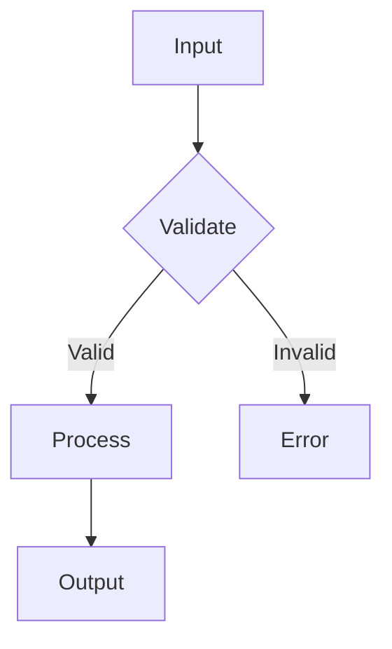

# Go Development Guide

A practical guide to Go development practices emphasizing readability, testability, and functional patterns. Self-contained reference for Go projects using [fluentfp](https://github.com/binaryphile/fluentfp).

**This guide serves two purposes:**
1. **Development practices** — Code style, testing methodology, benchmarking
2. **fluentfp reference** — Complete API for slice, option, ternary, and pair modules

---

## 1. The Goal: Readable, Testable Go

These practices exist to produce **readable, testable Go code** that remains maintainable as projects grow.

The compound benefit: when everyone follows the same patterns, code reviews focus on logic rather than style debates. New team members onboard faster. Refactoring becomes safer.

**Core principles:**
- Functional first (pure functions, immutability)
- Value semantics (pass by value, value receivers)
- Two-phase testing (TDD + Khorikov rebalancing)
- Continuous benchmarking

These aren't arbitrary rules. Each addresses a specific problem:

| Practice | Problem It Solves |
|----------|-------------------|
| Functional first | Hidden state changes, hard-to-test code |
| Value semantics | Unexpected mutation, aliasing bugs |
| Two-phase testing | Test bloat, false positives, missing coverage |
| Benchmarking | Performance regressions going unnoticed |

---

## 2. Functional First

Write pure functions that don't modify their inputs or rely on external state.

**Before (imperative, mutation):**
```go
func processUsers(users []User) {
    for i := range users {
        users[i].Name = strings.ToUpper(users[i].Name)
        users[i].Active = true
    }
}
```

**After (functional, immutable):**
```go
func processUsers(users []User) []User {
    return slice.From(users).Convert(func(u User) User {
        u.Name = strings.ToUpper(u.Name)
        u.Active = true
        return u
    })
}
```

**Why functional?**
- **Testable**: Pure functions have no hidden dependencies
- **Predictable**: Same input always produces same output
- **Composable**: Small functions combine into pipelines

**The three properties of pure functions:**
1. Output depends only on inputs
2. No side effects (no mutation, no I/O)
3. Referentially transparent (can replace call with result)

### Taking It Too Far

Don't force functional style when it obscures intent. If a simple struct assignment is clearer, use it:

```go
// This is fine - clear and direct
func (u User) WithEmail(email string) User {
    u.Email = email
    return u
}

// Don't do this just to be "functional"
func (u User) WithEmail(email string) User {
    return User{
        ID:     u.ID,
        Name:   u.Name,
        Email:  email,  // The one change
        Active: u.Active,
        // ... 10 more fields
    }
}
```

The first version is cleaner AND safer—adding a new field to User doesn't require updating this method.

---

## 3. Value Semantics

Pass and return values, not pointers. Use value receivers, not pointer receivers.

**Value semantics mean:**
- Functions receive copies of data
- Functions return new values (not modified inputs)
- Methods use value receivers

```go
// GOOD: Value semantics
func (u User) Activate() User {
    u.Active = true
    return u
}

// Use:
user = user.Activate()

// AVOID: Pointer semantics (unless necessary)
func (u *User) Activate() {
    u.Active = true
}
```

**When to use pointers:**

| Situation | Use Pointer? | Reason |
|-----------|--------------|--------|
| Large struct (>64 bytes) | Maybe | Profile first—copies are often faster than you think |
| Implements interface with pointer receiver | Yes | Consistency required |
| Needs to modify receiver | Consider | But prefer returning new value |
| Struct contains sync.Mutex | Yes | Mutex must not be copied |
| Database/network handle | Yes | Represents external resource |

**The default is value semantics.** Only use pointers when you have a specific reason.

### Taking It Too Far

Don't copy large structs repeatedly in hot loops without measuring. Value semantics are the default, but performance sometimes requires pointers:

```go
// If profiling shows this is slow due to copying:
func processLargeStructs(items []LargeStruct) {
    for i := range items {
        processOne(&items[i])  // Pointer is justified
    }
}
```

Profile before optimizing. Premature pointer use adds complexity for no benefit.

---

## 4. When Imperative is Better

Use imperative style when it's clearly more readable.

**Acceptable imperative patterns:**

```go
// Struct field assignment in a Convert lambda
slice.From(entries).Convert(func(e Entry) Entry {
    e.Field = computeValue(e)
    return e  // Imperative but clear
})

// Early return on error
func process(items []Item) error {
    for _, item := range items {
        if err := validate(item); err != nil {
            return err  // Imperative early exit
        }
    }
    return nil
}

// Accumulating into a map
func groupByCategory(items []Item) map[string][]Item {
    result := make(map[string][]Item)
    for _, item := range items {
        result[item.Category] = append(result[item.Category], item)
    }
    return result  // Maps don't have functional equivalents in Go
}
```

### Taking It Too Far

"Imperative when clearer" is not an excuse to avoid functional patterns entirely. If you find yourself never using `KeepIf`, `Convert`, or `Fold`, you're probably missing opportunities for cleaner code.

The guideline: **Start functional, go imperative when the functional version is harder to read.**

---

## 5. Two-Phase Testing

Testing has two distinct phases with different goals.

### Phase 1: Development (TDD)

During development, tests guide design:

1. **Red**: Write a failing test
2. **Green**: Make it pass (minimal code)
3. **Refactor**: Clean up

Write tests for everything at this stage. Tests help you think through the design. Some of these tests will be scaffolding.

### Phase 2: Pre-PR (Khorikov Rebalancing)

Before merging, reassess your test portfolio:

```
                    Few Collaborators    Many Collaborators
                    -----------------    ------------------
High Complexity     Domain/Algorithms    Overcomplicated
or Domain Sig       → UNIT TEST          → REFACTOR

Low Complexity      Trivial              Controllers
                    → DON'T TEST         → INTEGRATION TEST
```

| Quadrant | TDD Produced | Khorikov Action |
|----------|--------------|-----------------|
| Trivial | Unit tests | **Delete** |
| Domain/Algo | Unit tests | **Keep** |
| Controllers | Unit tests | **Replace** with integration |
| Overcomplicated | - | **Refactor first** |

**This is not a subset—it's a rebalancing.** Some tests TDD produced should be deleted. Others should be replaced. And Khorikov may reveal tests to add that TDD didn't produce.

### Testing Workflow

```
┌─────────────────────────────────────────────┐
│              DEVELOPMENT (TDD)              │
│  Write tests first → Red/Green/Refactor     │
│  Test everything while designing            │
└─────────────────────────────────────────────┘
                      │
                      ▼
┌─────────────────────────────────────────────┐
│           PRE-PR (KHORIKOV LENS)            │
│  Reassess each test:                        │
│  • Trivial? Delete                          │
│  • Domain/Algo? Keep                        │
│  • Controller? Replace with integration     │
│  • Add missing integration tests            │
└─────────────────────────────────────────────┘
                      │
                      ▼
┌─────────────────────────────────────────────┐
│              MERGE TO MAIN                  │
│  Clean test suite: domain units +           │
│  integration tests for controllers          │
└─────────────────────────────────────────────┘
```

---

## 6. Mocks = Design Smell

Needing mocks for internal collaborators indicates bad code design.

**The distinction:**

| Communication | Mock? | Why |
|---------------|-------|-----|
| **Inter-system** (external APIs, email, payment) | Yes | Observable to outside world |
| **Intra-system** (between your classes) | No | Fix design instead |

**If you need internal mocks, refactor:**

```go
// SMELL: Mocking internal repository
func TestOrderService_MocksRepository(t *testing.T) {
    mockRepo := &MockOrderRepository{}  // Design smell
    mockRepo.On("FindByID", "123").Return(order)
    service := OrderService{Repo: mockRepo}
    // ...
}

// BETTER: Test domain logic separately
func TestCalculateOrderTotal(t *testing.T) {
    order := Order{Items: []Item{{Price: 10}, {Price: 20}}}

    total := order.CalculateTotal()  // Pure function

    assert.Equal(t, 30.0, total)
}
```

**The fix is to redesign:**
- Extract pure domain logic (testable without mocks)
- Keep controllers thin (integration test the wiring)
- Only mock at external boundaries

### Taking It Too Far

External boundaries (email, payment, third-party APIs) should still use mocks or test doubles. The smell is internal mocks, not all mocks:

```go
// OK: Mocking external email gateway
func TestOrderProcessor_SendsConfirmationEmail(t *testing.T) {
    mockGateway := &SpyEmailGateway{}
    processor := OrderProcessor{EmailGateway: mockGateway}

    processor.CompleteOrder(order)

    assert.True(t, mockGateway.SendCalled)
}
```

---

## 7. Benchmarking

Run benchmarks on each build and track results in CLAUDE.md.

### Writing Benchmarks

```go
func BenchmarkFilterConversation(b *testing.B) {
    entries := generateTestEntries(1000)

    b.ResetTimer()
    for i := 0; i < b.N; i++ {
        _ = filterConversation(entries)
    }
}
```

### Running Benchmarks

```bash
go test -bench=. -benchmem ./internal/...
```

### Key Metrics

| Metric | Meaning | Concern Threshold |
|--------|---------|-------------------|
| `ns/op` | Nanoseconds per operation | Depends on operation |
| `B/op` | Bytes allocated per operation | Unexpected growth |
| `allocs/op` | Allocations per operation | Unexpected growth |

### Tracking Results

Record baseline and current results in CLAUDE.md:

```markdown
### Benchmarks

**Latest (2026-01-10):**
```
BenchmarkProcess-8    5320    214687 ns/op    178861 B/op    3001 allocs/op
```

**Baseline:**
```
BenchmarkProcess-8    54512   22801 ns/op     106498 B/op    1 allocs/op
```

Note: Regression expected due to [reason]. Correctness over speed.
```

Document regressions with rationale. Not every regression is bad—sometimes correctness requires more allocations.

---

## 8. Using fluentfp

[fluentfp](https://github.com/binaryphile/fluentfp) provides functional operations for Go slices.

### When to Use fluentfp

| Use fluentfp when... | Use raw loops when... |
|----------------------|----------------------|
| Transforming entire collections | Early exit on first match |
| Filtering with clear predicates | Accumulating into maps |
| Chaining operations readably | Performance-critical hot paths |
| Method references available | Index access needed mid-loop |

### slice Package

```go
import "github.com/binaryphile/fluentfp/slice"
```

| Function | Signature | Purpose |
|----------|-----------|---------|
| `From` | `From[T]([]T) Mapper[T]` | Create fluent slice |
| `KeepIf` | `.KeepIf(func(T) bool)` | Filter (keep matching) |
| `RemoveIf` | `.RemoveIf(func(T) bool)` | Filter (remove matching) |
| `Convert` | `.Convert(func(T) T)` | Map same type |
| `ToInt` | `.ToInt(func(T) int)` | Map to int |
| `ToString` | `.ToString(func(T) string)` | Map to string |
| `ToFloat64` | `.ToFloat64(func(T) float64)` | Map to float64 |
| `ToBool` | `.ToBool(func(T) bool)` | Map to bool |
| `ToAny` | `.ToAny(func(T) any)` | Map to any |
| `Each` | `.Each(func(T))` | Side effect per element |
| `TakeFirst` | `.TakeFirst(n int)` | First n elements |
| `Len` | `.Len() int` | Slice length |
| `Fold` | `Fold[T,R]([]T, R, func(R,T)R)` | Reduce to single value |
| `Unzip2` | `Unzip2[T,A,B]([]T, fa, fb)` | Extract 2 fields |
| `Unzip3` | `Unzip3[T,A,B,C]([]T, fa, fb, fc)` | Extract 3 fields |
| `Unzip4` | `Unzip4[T,A,B,C,D]([]T, fa, fb, fc, fd)` | Extract 4 fields |

### Examples

```go
// Filter and transform
activeNames := slice.From(users).
    KeepIf(User.IsActive).
    ToString(User.GetName)

// Method references for clarity
slice.From(developers).KeepIf(Developer.IsIdle).ToString(Developer.GetName)

// Fold to sum
sum := slice.Fold(numbers, 0, func(acc, n int) int { return acc + n })

// Extract multiple fields in one pass
ids, amounts := slice.Unzip2(orders, Order.GetID, Order.GetAmount)
```

### Taking It Too Far

Don't chain when a single pass suffices:

```go
// BAD: Two intermediate slices
slice.From(xs).ToInt(f).ToInt(g)

// BETTER: Single pass
slice.From(xs).ToInt(func(x int) int { return g(f(x)) })
```

See [Section 12: When NOT to Use fluentfp](#12-when-not-to-use-fluentfp) for early exit, map accumulation, and performance considerations.

---

## 9. Option Type for Nil Safety

The Option type makes "might not exist" explicit.

```go
import "github.com/binaryphile/fluentfp/option"
```

### Why Option over *T

| Pointer (*T) | Option |
|--------------|--------|
| Nil checks scattered through code | Explicit handling at creation |
| Runtime panic on nil dereference | Compile-time type safety |
| "Was nil intentional or a bug?" | Clear semantics |

### option Package

| Function | Signature | Purpose |
|----------|-----------|---------|
| `Of` | `Of[T](T) Basic[T]` | Create ok option |
| `NotOk` | `NotOk[T]() Basic[T]` | Create not-ok option |
| `New` | `New[T](T, bool) Basic[T]` | Create from value + ok |
| `FromOpt` | `FromOpt[T](*T) Basic[T]` | From pointer (nil-safe) |
| `IfProvided` | `IfProvided[T comparable](T)` | Not-ok if zero value |
| `Getenv` | `Getenv(string) String` | From environment variable |
| `Map` | `Map[T,R](Basic[T], func(T)R)` | Transform value |
| `.Get` | `.Get() (T, bool)` | Unwrap with ok |
| `.IsOk` | `.IsOk() bool` | Check if ok |
| `.MustGet` | `.MustGet() T` | Unwrap or panic |
| `.Or` | `.Or(T) T` | Value or default |
| `.OrCall` | `.OrCall(func() T) T` | Value or lazy default |
| `.OrEmpty` | `.OrEmpty() T` | Value or zero (strings) |
| `.OrZero` | `.OrZero() T` | Value or zero (generic) |
| `.KeepOkIf` | `.KeepOkIf(func(T) bool)` | Filter option |
| `.ToNotOkIf` | `.ToNotOkIf(func(T) bool)` | Filter with negation |
| `.ToInt` | `.ToInt(func(T) int)` | Transform to int option |
| `.ToSame` | `.ToSame(func(T) T)` | Transform same type |
| `.Call` | `.Call(func(T))` | Side effect if ok |
| `.ToOpt` | `.ToOpt() *T` | Convert to pointer |

### Examples

```go
// Create options
found := option.Of("hello")           // Ok option
missing := option.NotOk[string]()     // Not-ok option

// From pointer (nil-safe)
var ptr *string = nil
opt := option.FromOpt(ptr)            // Not-ok if nil

// Environment variables
port := option.Getenv("PORT").Or("8080")

// Unwrap with defaults
value := opt.Or("default")
value := opt.OrCall(expensiveComputation)

// Check and extract
if val, ok := opt.Get(); ok {
    // Use val
}

// Transform
userOpt := option.Map(opt, func(s string) User { return User{Name: s} })
```

---

## 10. Ternary Expressions

Go lacks a ternary operator. fluentfp provides one.

```go
import "github.com/binaryphile/fluentfp/ternary"
```

### ternary Package

| Function | Signature | Purpose |
|----------|-----------|---------|
| `If` | `If[R](bool) Ternary[R]` | Start ternary |
| `.Then` | `.Then(R) Ternary[R]` | Value if true |
| `.ThenCall` | `.ThenCall(func() R)` | Lazy value if true |
| `.Else` | `.Else(R) R` | Value if false |
| `.ElseCall` | `.ElseCall(func() R) R` | Lazy value if false |

### Examples

```go
// Basic ternary
max := ternary.If[int](a > b).Then(a).Else(b)

// Lazy evaluation for expensive computations
result := ternary.If[string](cached).
    Then(cachedValue).
    ElseCall(expensiveComputation)
```

**Note:** `Then`/`Else` values are evaluated immediately. Use `ThenCall`/`ElseCall` when computation is expensive and should only run if selected.

---

## 11. Pairs and Zip

Combine elements from two slices.

```go
import "github.com/binaryphile/fluentfp/tuple/pair"
```

### tuple/pair Package

| Function | Signature | Purpose |
|----------|-----------|---------|
| `Of` | `Of[A,B](A, B) X[A,B]` | Create pair |
| `Zip` | `Zip[A,B]([]A, []B) []X[A,B]` | Zip two slices |
| `ZipWith` | `ZipWith[A,B,R]([]A, []B, func(A,B)R)` | Zip with function |

### Examples

```go
// Create a pair
p := pair.Of("key", 42)

// Zip two slices
names := []string{"Alice", "Bob", "Carol"}
ages := []int{30, 25, 35}
pairs := pair.Zip(names, ages)
// [{Alice 30}, {Bob 25}, {Carol 35}]

// ZipWith applies function to corresponding elements
sums := pair.ZipWith([]int{1, 2, 3}, []int{10, 20, 30}, func(a, b int) int {
    return a + b
})
// [11, 22, 33]
```

**Note:** `Zip` panics if slices have different lengths. Check lengths first if unsure.

---

## 12. When NOT to Use fluentfp

Raw loops are better in specific situations.

### Early Exit

```go
// fluentfp: Must iterate entire slice
found := slice.From(users).KeepIf(User.IsAdmin)
if len(found) > 0 {
    return found[0]
}

// Raw loop: Stops immediately
for _, u := range users {
    if u.IsAdmin() {
        return u
    }
}
```

### Accumulating into Maps

```go
// No fluentfp equivalent
func groupByCategory(items []Item) map[string][]Item {
    result := make(map[string][]Item)
    for _, item := range items {
        result[item.Category] = append(result[item.Category], item)
    }
    return result
}
```

### Performance-Critical Paths

```go
// If profiling shows fluentfp overhead matters:
func processHotPath(data []int) int {
    sum := 0
    for _, v := range data {
        sum += v * v
    }
    return sum
}
```

### Index Access Mid-Loop

```go
// Need to compare with neighbors
for i := 1; i < len(items)-1; i++ {
    if items[i] > items[i-1] && items[i] > items[i+1] {
        // Found local maximum
    }
}
```

### Decision Flowchart

1. **Does the operation fit map/filter/fold?** → Use fluentfp
2. **Need early exit (break)?** → Use raw loop
3. **Accumulating into a map?** → Use raw loop
4. **Performance-critical inner loop?** → Profile first, then decide
5. **Readability improves with chaining?** → Use fluentfp

---

## 13. Documentation First

Write documentation before implementation.

### Required Documents

| Document | Purpose | Template |
|----------|---------|----------|
| `docs/use-cases.md` | Actor-Goal List, casual use cases | Use-case-skill format |
| `docs/design.md` | Architecture, data flow | Mermaid diagrams |

### Mermaid Diagrams

Use Mermaid for architecture and flows:

```markdown

```

### Markdown Style

- **Obsidian-compatible** but use standard markdown links
- **Standard links**: `[text](path.md)` not `[[obsidian]]` style
- **Space after headings**: Always one blank line after `##`
- **Tables for comparisons**: Convert prose to tables when 3+ items

---

## 14. Summary

### Core Practices

| Practice | Key Rule |
|----------|----------|
| Functional first | Pure functions, return new values |
| Value semantics | Pass by value, value receivers |
| Imperative exception | When clearly more readable |
| Two-phase testing | TDD → Khorikov rebalancing |
| Mocks | Only at external boundaries |
| Benchmarks | Track in CLAUDE.md |
| fluentfp | For collection pipelines |
| Documentation | Write before implementing |

### Decision Flowchart: Functional vs Imperative

```
Start
  │
  ▼
┌─────────────────────────┐
│ Can it be a pure        │
│ function?               │
└─────────────────────────┘
  │           │
  Yes         No
  │           │
  ▼           ▼
┌─────────┐ ┌─────────────────┐
│ Use     │ │ Is imperative   │
│ fluentfp│ │ clearly simpler?│
└─────────┘ └─────────────────┘
              │           │
              Yes         No
              │           │
              ▼           ▼
          ┌─────────┐ ┌─────────────┐
          │ Use raw │ │ Refactor to │
          │ loop    │ │ enable FP   │
          └─────────┘ └─────────────┘
```

---

## 15. Quick Reference for CLAUDE.md

```markdown
### Go Development Practices

**Code Style:**
- Functional first: pure functions, immutability, composition
- Value semantics: pass/return by value, value receivers
- Imperative exception: when clearly more readable

**Testing (Two Phases):**
| Phase | Focus | Action |
|-------|-------|--------|
| TDD | Development | Write tests first |
| Pre-PR | Khorikov | Delete trivial, keep domain, replace controllers |

**Mocks:** Only at external boundaries. Internal mocks = design smell.

**Benchmarks:** Run on build, track in CLAUDE.md.
```bash
go test -bench=. -benchmem ./internal/...
```

**fluentfp:**
| Use | Don't Use |
|-----|-----------|
| Collection transforms | Early exit needed |
| Filter/map pipelines | Map accumulation |
| Method references | Hot paths (profile first) |

**Common patterns:**
```go
// Filter and transform
slice.From(users).KeepIf(User.IsActive).ToString(User.GetName)

// Option for nil safety
port := option.Getenv("PORT").Or("8080")

// Ternary
max := ternary.If[int](a > b).Then(a).Else(b)
```

**Documentation:** Write use-cases.md and design.md first.
```

---

*Based on practices from [claude-session-transfer](https://github.com/binaryphile/claude-session-transfer) CLAUDE.md.*
